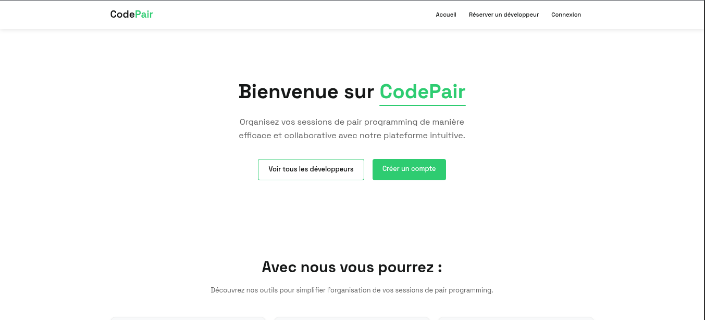

# 🚀 **CodePair**🚀

  

# CodePair est un site de réservation de développeur web, dans le but de pouvoir coder ensemble sur des projets personnels. Ce site est entièrement codé en PHP & CSS.

# Vous pouvez y acceder à partir de cet url -> https://codepair.michel.djoumessi.mmi-velizy.fr/
